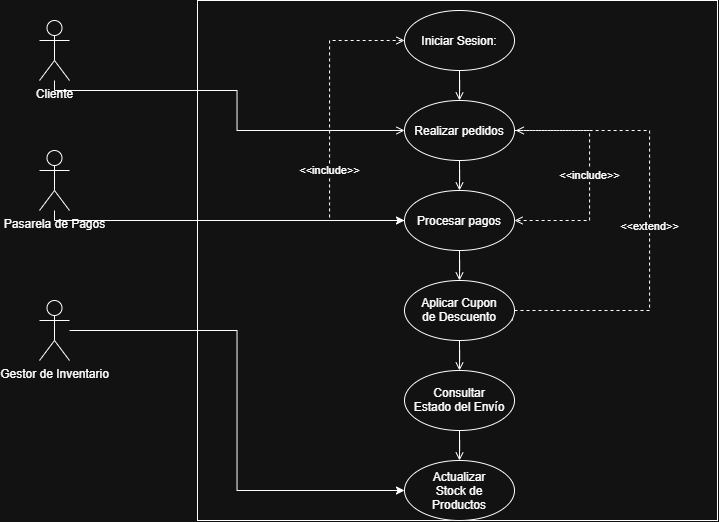
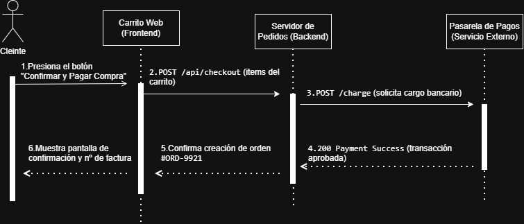

# Documentación de Arquitectura: Casos de Uso

## 1. Descripción del Módulo
El presente documento define los requisitos funcionales del **Sistema de Gestión Hospitalaria**. Se detalla la interacción entre los actores (Paciente, Médico, Administrador) y las funcionalidades del sistema.

## 2. Diagrama UML de Casos de Uso


## 3. Especificación de Relaciones
* **Relaciones <<include>>:** *Reservar Cita* y *Generar Factura* requieren obligatoriamente la autenticación previa del usuario en el sistema.
* **Relaciones <<extend>>:** *Aplicar Descuento de Seguro* se ejecuta únicamente si la factura generada cuenta con cobertura médica.
````[cite: 4]

---

### 2. Archivo `docs/arquitectura/secuencia-autenticacion.md`

````markdown
# Especificación de Secuencia: Autenticación de Usuario

## 1. Contexto del Flujo
Se describe la interacción temporal entre la interfaz móvil, la API backend y la base de datos para la validación de credenciales.

## 2. Diagrama UML de Secuencia


## 3. Detalle de los Pasos
1. El usuario ingresa sus credenciales en la aplicación.
2. La aplicación envía una solicitud HTTP POST al servidor.
3. El servidor valida la información consultando la base de datos.
4. La base de datos responde con los datos del usuario.
5. El servidor genera y retorna un token de sesión `200 OK`.
6. La aplicación muestra la pantalla principal.
````[cite: 5]

---

### 3. Sección para el `README.md` (Sección 5)

````markdown
## 5. Enlaces Útiles
- [Ver Arquitectura del Sistema](docs/arquitectura.md)
- [Ver Casos de Uso Hospitalarios](docs/arquitectura/casos-de-uso.md)
- [Ver Diagrama de Secuencia de Login](docs/arquitectura/secuencia-autenticacion.md)
- [Ver Arquitectura del Sistema](docs/arquitectura.md)
- [Ver Manual de Usuario](docs/manual_usuario.md)
- [Ver Especificación de API](docs/api_endpoints.md)
- [Repositorio Oficial en GitHub](https://github.com/gaps3600/documentacion-sistema-v1-)
````[cite: 6]